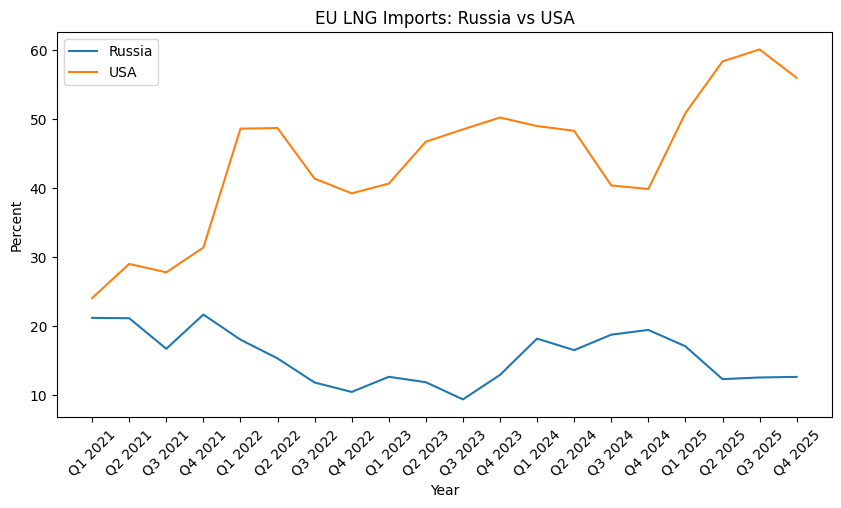

# EU LNG Imports: Russia vs USA (2021–2025)

## Project Overview

This project analyzes changes in the structure of European Union LNG imports between 2021 and 2025.

The analysis compares the share of LNG imports from Russia and the United States using Eurostat data.

## Research Question

How did the shares of Russian and American LNG imports to the European Union change after 2021?

## Data Source

Eurostat – Imports of liquefied natural gas from main partners.

## Key Findings

- The United States became the dominant LNG supplier to the European Union.
- Russia's share declined after 2021.
- LNG imports became more diversified over time.
- Diversification improved EU energy security.

## Tools

- Python
- Pandas
- Matplotlib
- GitHub

## Visualization

The chart shows quarterly changes in LNG import shares from Russia and the United States between 2021 and 2025.

