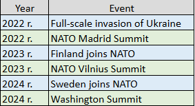

## NATO Adaptation After Russia’s Full-Scale Invasion of Ukraine (2022–2024)
# Research Question
How did NATO adapt its strategic posture following Russia’s full-scale invasion of Ukraine in 2022?

# Hypothesis
Russia’s invasion of Ukraine accelerated NATO’s military adaptation, strengthened collective defence measures, and contributed to the enlargement of the Alliance.

# Methodology
This project uses a qualitative timeline analysis of key NATO-related events between 2022 and 2024. Major political and military developments were identified and assessed based on their strategic significance for European security.

# Findings
Several developments indicate a substantial transformation of NATO’s strategic posture after 2022. The Madrid Summit introduced a new strategic concept focused on deterrence and defence. Finland and Sweden joined the Alliance, significantly strengthening NATO’s northern flank and increasing security in the Baltic region. Subsequent summits in Vilnius and Washington continued efforts to improve readiness, defence planning, and support for Ukraine.

# Conclusions
The analysis suggests that Russia’s full-scale invasion of Ukraine marked a turning point in European security. NATO responded by reinforcing collective defence, increasing military preparedness, and expanding its membership. The accession of Finland and Sweden improved NATO’s strategic position in Northern Europe and enhanced security in the Baltic Sea region. Overall, the Alliance demonstrated a significant capacity for adaptation in response to changing security conditions.

## Timeline of Key Events

| Year | Event |
|------|--------|
| 2022 | Full-scale invasion of Ukraine |
| 2022 | NATO Madrid Summit |
| 2023 | Finland joins NATO |
| 2023 | NATO Vilnius Summit |
| 2024 | Sweden joins NATO |
| 2024 | Washington Summit |

### Timeline Reference

