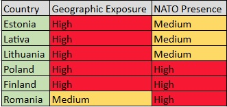

# NATO Eastern Flank Security Assessment (2022–2025)

## Project Overview

This project evaluates the strategic importance and security posture of NATO's Eastern Flank following Russia's full-scale invasion of Ukraine in 2022.

The analysis focuses on selected frontline NATO members and examines military, geographic, and strategic factors influencing regional security.

## Research Question

How has NATO's Eastern Flank changed since 2022 and which member states play the most important role in regional deterrence and defence?

## Countries Analysed

- Estonia
- Latvia
- Lithuania
- Poland
- Finland
- Romania

## Assessment Factors

- Geographic exposure
- NATO military presence
- Defence spending
- Strategic importance
- Security vulnerabilities

- 

## Key Findings
- Poland has emerged as NATO's primary military hub on the Eastern Flank.
- Finland's accession significantly strengthened NATO's northern defence posture.
- Romania plays an increasingly importnat role in Black Sea security.
- NATO's post-2022 strategy shifted from deterrence by presence to forward defence.
